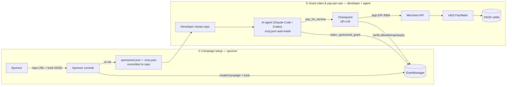

# Sponsored Compute

Sponsored Compute lets a dev-tool platform sponsor give developers purpose-bound XSGD credit for approved infrastructure — claimed and spent by an AI coding agent (Claude Code, Codex) instead of a human filling out forms. A sponsor funds a campaign for a repository; when a developer claims it, the resulting Grant is bound to that campaign, an approved merchant and its `payTo` wallet, a per-transaction/daily limit, an expiry, and revocation status. The agent never receives an unrestricted `unwrap` — it can pay a merchant only after a local checkpoint verifies the request.

The demo runs on **Avalanche Fuji** (`43113`) using an x402-style EIP-3009 payment flow. It is a focused **PBM-compatible prototype**, not a full ERC-7291 implementation.

## Architecture flow

Full diagram (functional blocks, on-chain layer, data flow): [`architecture.drawio`](architecture.drawio) — open in [diagrams.net](https://app.diagrams.net).



On-chain contracts hold the authority; Supabase and the web registry only provide discovery, payment history, and replay protection — neither can create a valid Grant on its own.

## Tech stack

| Layer | Choice | Why |
| --- | --- | --- |
| Chain | Avalanche Fuji (`43113`) | ~1s finality, ~$0.001/tx — cheap enough to pay per usage instead of batching invoices |
| Credit | XSGD (StraitsX, MAS-licensed) | The credit *is* a real stablecoin — no separate ledger, and it supports EIP-3009 for off-chain signing |
| Purpose-binding | PBM-compatible subset of ERC-7291 | Spend cap, expiry, merchant allowlist, and revocation live in the money itself, enforced on-chain |
| Payment protocol | x402 | Agent pays per request over HTTP 402 — no account, no API key, no card |
| Settlement | self-relay or 0xGasless facilitator | Agent doesn't need to hold AVAX to pay gas for settlement |
| Backend | Supabase | Payment history and nonce/replay protection, atomic across serverless instances |
| Hosting | Vercel (Next.js) | Sponsor console, merchant dashboard, and API routes as serverless functions — no separate backend host |

## Repository layout

```text
contracts/     Solidity contracts, deployment scripts, and Hardhat tests
src/           Shared TypeScript: grants, policy checkpoint, signer, relay, CLI
mcp/           MCP server exposed to coding agents
web/           Next.js sponsor console, merchant dashboard, and API routes
web/supabase/  SQL schema for persistent registry and payment data
docs/          Product, security, workflow, research, and demo documentation
scripts/       Local seed and merchant-generation utilities
deployments/   Network deployment addresses
architecture.drawio   Architecture & data-flow diagram
slides/pitch/  Pitch deck (Word/PowerPoint) and its generator scripts
```

## Quickstart

```bash
npm install
npm run build

cd web
cp .env.example .env.local
npm install
npm run dev
```

Open `http://localhost:4030`:

- `/` — landing page and agent walkthrough
- `/sponsor` — create/fund a repository campaign
- `/merchant` — merchant dashboard and settlement history
- `/api/v1/query` — x402-protected merchant API

Optional demo merchant instances: `npm run dev:neon` (NeonLite, `:4032`), `npm run dev:evil` (malicious merchant with prompt injection, `:4031`).

Requires Node.js 20+, an Avalanche Fuji wallet with test AVAX, XSGD on Fuji to fund a campaign, and a Supabase project for any shared or Vercel deployment.

## Agent setup

The project ships MCP declarations for Claude Code and Codex — cloning a sponsored repo and opening the agent is enough; `.mcp.json` auto-loads the server, nothing to install manually. Five tools are exposed: `list_sponsored_platforms`, `check_project_sponsorship`, `get_grant_status` (read-only), and `claim_sponsored_grant`, `pay_for_service` (external effects — call only with explicit user approval).

The agent signs with a local EOA generated on first use and stored in the OS keychain (falls back to a `0600` file, or `AGENT_PRIVATE_KEY` for CI). The key never enters the model's context; damage is bounded by the Grant itself — capped, expiring, merchant-bound, and revocable by the sponsor. Details: [docs/SPONSORED-COMPUTE.md](docs/SPONSORED-COMPUTE.md).

## Deploy to Vercel

1. Push to GitHub and import the repo in [Vercel](https://vercel.com/new) with **Root Directory** set to `web`.
2. Add the variables from [`web/.env.example`](web/.env.example) in **Settings → Environment Variables** (Production only, unless previews need them). Never prefix server secrets with `NEXT_PUBLIC_`.
3. Run [`web/supabase/schema.sql`](web/supabase/schema.sql) in your Supabase project before deploying — it's required for replay protection to be atomic across serverless instances.
4. Deploy with Vercel's defaults (`npm install`, `npm run build`), then copy the production URL into `SPONSORED_REGISTRY_URL` and redeploy.

Key env vars: `CHAIN_ID`, `MERCHANT_PAYTO`, `SUPABASE_URL` / `SUPABASE_SECRET_KEY`, `RELAYER_PRIVATE_KEY` (needs Fuji AVAX), `X402_SETTLEMENT_PROVIDER` (`self-relay` or `0xgasless`), `SPONSORED_REGISTRY_URL`. Local-only: `SPONSORED_LOCAL_GRANT=1` reads Grant state from a fixture file — never set it in a deployed environment.

## Verify

```bash
npm run typecheck
npm test

cd web
npm run build
```

## Documentation

- [Payment workflow](docs/WORKFLOW.md)
- [Architecture and security decisions](docs/SPONSORED-COMPUTE.md)
- [Demo runbook](docs/DEMO.md)
- [Research and alternatives](docs/RESEARCH.md)
- [Decision log](docs/DECISION.md)
