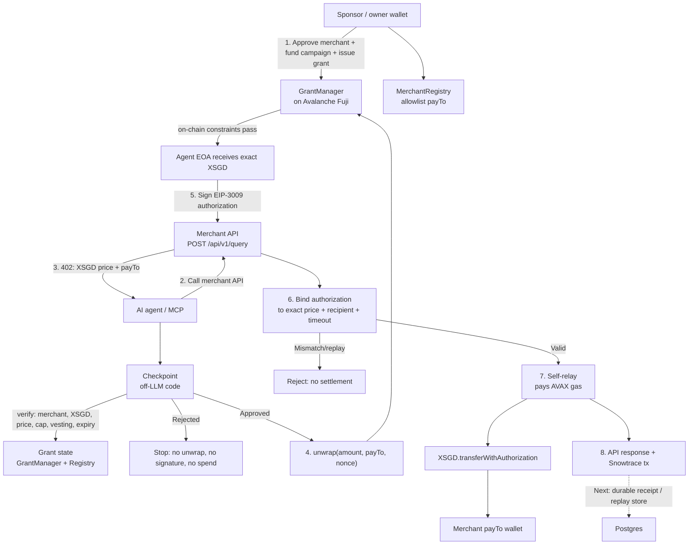

# Sponsored Compute — Payment Workflow

## Security boundaries

1. The agent cannot decide to spend by itself: checkpoint runs before unwrap or signing.
2. `GrantManager` enforces merchant allowlist, per-transaction/daily caps, vesting, expiry, and revocation on-chain.
3. The merchant binds the submitted EIP-3009 authorization to the exact invoice recipient, amount, and validity window before self-relay settlement.
4. A mismatch, expired authorization, or replay is rejected before data is served or a transaction is broadcast.
5. The merchant serves the paid response only after the XSGD transfer succeeds on-chain.

## Production follow-up

Use a durable Postgres-backed receipt and nonce-claim store before deployment so payment history and replay protection survive instance restarts and redeploys.
