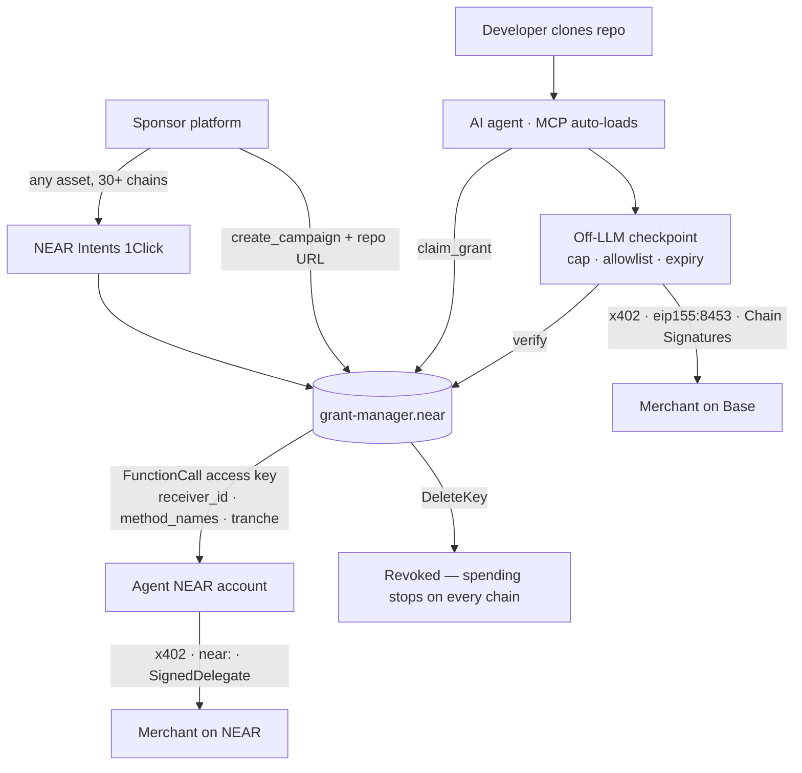

# Sponsored Compute — NEAR Foundation Grant Application

**Purpose-bound infrastructure credit for AI coding agents.**

| | |
|---|---|
| **Requested amount** | **USD 6,500** |
| **Duration** | 4 months, milestone-based |
| **Category** | AI × blockchain · autonomous on-chain agents · chain abstraction |
| **Licence** | MIT — contract, MCP server, and agent skill all open source |
| **Status** | Pre-build. Prior work shipped on NEAR (§5) |

> ⚠️ **Before submitting — fill in:** team names and roles (§9), NEAR account IDs, contact email, and prior-work links you want reviewers to open. Do not submit with placeholders.

---

## 1. Summary

Developer-tool platforms want to sponsor infrastructure costs for developers. Today they cannot do it safely: shared credit leaks to competitors, and handing a budget to an AI agent invites runaway bills.

Sponsored Compute lets a sponsor escrow USDC on NEAR against a specific repository. A developer's AI coding agent claims a grant and spends it **per use** through x402 — capped, time-limited, restricted to approved merchants, and revocable by the sponsor in a single transaction.

We are building this on NEAR because **NEAR's account model already contains the mechanism.** A `FunctionCall` access key natively restricts which contract may be called and which methods may run, cannot attach a token deposit at all, and is revoked instantly by `DeleteKey`. On every other chain we evaluated, those properties are thousands of lines of custom contract code that must be written, audited, and trusted. On NEAR they are protocol runtime.

---

## 2. Problem

**Developers in Southeast Asia cannot pay for infrastructure.** No international credit card, FX friction, cross-border blocks. The skills exist; the payment rail does not.

**Sponsors have no safe way to fund them.** Shared credit has a fatal economic flaw: if platform A funds a developer who spends at platform B, A gets nothing. Credit must be purpose-bound at the moment of issuance.

**Giving a budget to an agent is an unsolved risk.** A database runs 24/7. An agent that provisions metered infrastructure with someone else's money is the classic setup for a surprise invoice. A hard cap must **stop the service**, not merely stop the credit.

---

## 3. Why NEAR

| NEAR primitive | What it replaces |
|---|---|
| **`FunctionCall` access key** — `receiver_id` + `method_names` allowlist; cannot attach a deposit; `DeleteKey` revokes instantly | A hand-written purpose-bound-money contract with a compliance guard. Removes our highest-risk code and shrinks the audit surface |
| **Chain Signatures (`v1.signer`)** — deterministic addresses on Base, Ethereum, Solana, Bitcoin derived from a NEAR account | Separate per-chain keys. Revoking on NEAR removes signing authority on every chain at once — no key can have been copied elsewhere |
| **x402 on NEAR** — `near:` network, NEP-366 `SignedDelegate`, NEP-141 transfer, facilitator sponsors gas *and* the 1 yoctoNEAR deposit | A self-run gasless relayer. The agent never holds a gas token on any chain |
| **NEAR Intents (1Click)** — 30+ origin chains | Forcing sponsors to acquire one specific asset on one specific chain before they can fund anything |

**The property that only NEAR gives us:** on an EVM-only design, revoking a grant means *trusting* that the key was never copied. On NEAR, spending authority *is* the access key — deleting it ends spending everywhere, verifiably.

---

## 4. What we will build

**In scope**
- `grant-manager.near` (Rust): campaigns, escrow, claims, tranche release, revocation
- Function-call access key issuance bound to a campaign's merchant allowlist and expiry
- MCP server exposing five tools to Claude Code and Codex, with an off-LLM policy checkpoint
- **x402 payments on NEAR** (`near:` scheme) and on Base via Chain Signatures
- Sponsor console and merchant dashboard
- Multi-chain funding through NEAR Intents 1Click, with a swap cost guard
- Anti-abuse: per-repo grant binding, sponsor-run repository verification, tranche release

**Explicitly out of scope for this grant**
- No separate credit ledger — the credit *is* USDC
- No fiat, virtual cards, or on/off-ramp
- No permissionless merchant registration (manually curated allowlist; see §8)
- No project token

---

## 5. Why us — prior work shipped on NEAR

We are not starting from a whitepaper. Two codebases already exist.

**[kurodenjiro/Anyone-pay](https://github.com/kurodenjiro/Anyone-pay)** — a working NEAR application that already implements the hardest part of this proposal:

| Component | What it does |
|---|---|
| `lib/chainSig.ts` | Signs EIP-3009 `transferWithAuthorization` through the `v1.signer` MPC contract — Chain Signatures in production, not in theory |
| `lib/kdf.ts` | Deterministic address derivation from a NEAR account |
| `lib/oneClick.ts` | NEAR Intents 1Click integration via `@defuse-protocol/one-click-sdk-typescript` |
| `contract/src/lib.rs` | Deployed `near-sdk` Rust contract with cross-contract callbacks |
| `lib/nearAI.ts` | NEAR AI Cloud integration |

**Sponsored Compute (this project)** — we previously prototyped the sponsorship model, the MCP tool surface, the off-LLM checkpoint, and the list-integrity rules (§7) on an EVM chain. That prototype is why we are applying: building it there required hand-rolling the purpose-binding mechanism in Solidity. **We are moving to NEAR because the mechanism is native here.** This application is that judgement, made with the code already written once.

### An ecosystem gap we will close

The official [NearDeFi/agent-payments-skill](https://github.com/NearDeFi/agent-payments-skill) settles **Base mainnet only** — its source states `only Base mainnet is supported (no testnets / other chains)`. x402 supports NEAR as a first-class network, but there is no open reference client for it in the agent tooling.

**We will ship an open-source x402-on-NEAR client** (NEP-366 `SignedDelegate` + NEP-141) usable by any NEAR agent project, not just ours.

---

## 6. Architecture

The contract holds all authority. Off-chain services provide discovery and history only; neither can mint a valid grant.

---

## 7. Conflict-of-interest commitments

An agent that recommends tools with money behind them is selling trust, and trust sells once. These rules are non-negotiable and ship in v1:

1. **Always show unsponsored options**, clearly labelled — *"3 sponsored · 2 not"*
2. **Never sell ranking** — order by technical fit; sponsorship is a label, never a position
3. **Only show the list when the user asks** — the agent never manufactures demand

Applied to the merged list across all three sources (x402-list, Coinbase Bazaar, our sponsor registry) — not only to our own entries.

---

## 8. Milestones

| # | Deliverable | Acceptance criteria | Weeks | USD |
|---|---|---|---|---|
| **M1** | `grant-manager.near` + access key issuance | Contract deployed to testnet. Campaign create/fund/claim/revoke work. Access key restricted to allowlisted merchant and methods. Exceeding a cap is rejected on-chain. `near-workspaces` suite green | 1–4 | **1,000** |
| **M2** | x402 payment rails | Agent pays a live merchant on NEAR via `near:` scheme (NEP-366 `SignedDelegate`), and a live x402 merchant on Base via Chain Signatures. Agent holds **no gas token on either chain**. Open-source x402-on-NEAR client published | 5–8 | **1,000** |
| **M3** | Anti-abuse + sponsor console | Grants bound per `(campaign, repo)`. Sponsor-run repo verification. Tranche release live. Sponsor console and merchant dashboard usable by a non-technical operator | 9–12 | **1,000** |
| **M4** | Mainnet launch | Deployed to NEAR mainnet with real funds. **≥3 sponsor platforms and ≥10 developer grants claimed.** Public demo: sponsor calls `DeleteKey`, spending halts on all chains simultaneously. Docs and integration guide published | 13–16 | **1,000** |
| — | Independent contract security review | External reviewer's report published before mainnet (gate on M4) | 11–12 | **1,500** |
| — | Infrastructure | RPC tiers, hosting, facilitator fees — 4 months | — | **600** |
| — | Demo working capital | USDC funding live demo campaigns (recoverable) | — | **400** |
| | | | | **6,500** |

**Self-funded:** we are contributing USD 600 of our own and our own labour to reach M1 regardless of this grant's outcome.

**On the size of this request:** the milestone amounts cover tooling, infrastructure, and transaction costs — not salaries. Engineering time is contributed by the team. We have kept the ask deliberately small because the work is already partly de-risked by existing code (§5), and we would rather deliver against a modest, fully-met budget than over-ask on a first application.

---

## 9. Team

> **FILL IN BEFORE SUBMITTING.** For each member: name, role, NEAR account, GitHub, and one line of relevant experience. Reviewers weigh execution capability heavily on a pre-build application — the Anyone-pay codebase (§5) is the strongest evidence available; name whoever wrote it.

| Name | Role | Links |
|---|---|---|
| *(fill in)* | Contract & protocol | *(GitHub, NEAR account)* |
| *(fill in)* | Agent & frontend | *(GitHub)* |

**Contact:** *(fill in)*

---

## 10. Ecosystem impact

| Metric | Target by M4 |
|---|---|
| Sponsor platforms onboarded | ≥ 3 |
| Developer grants claimed | ≥ 10 |
| x402 payments settled on NEAR | ≥ 100 |
| Open-source artifacts | `grant-manager.near`, MCP server, **x402-on-NEAR client** — all MIT |

**Beyond our own product**, this grant produces two reusable assets for the NEAR ecosystem:

1. **An x402-on-NEAR reference client** — closing the gap described in §5. Any NEAR agent project can use it.
2. **A documented pattern for bounded agent budgets on NEAR** — using function-call access keys as spending authority. Applicable well beyond infrastructure credit: agent allowances, DAO delegated budgets, subscription mandates.

We also intend to onboard sponsor platforms who are **not currently on NEAR** — they fund in whatever asset they hold and NEAR Intents handles the rest, so the integration cost of reaching NEAR is near zero for them.

---

## 11. Risks

| Risk | Mitigation |
|---|---|
| **No production facilitator supports NEAR reliably** | The default x402.org facilitator does not cover NEAR. We select and verify one in week 1 as an M1 gate. Fallback: direct `ft_transfer_call` settlement, at the cost of the agent needing NEAR gas |
| **Merchant collusion** — a developer spends the grant at their own merchant and cashes out | Sponsor-curated merchant allowlist, a clawback window before merchant withdrawal, and tranche release capping the loss per attempt. This is why permissionless merchant registration is out of scope (§4) |
| **Sybil grant farming** | Grants bound per `(campaign, repo)`, sponsor-run repository ownership verification, sponsor-set repo thresholds, and small tranches — so the value extractable per fake repo is below the cost of creating one |
| **Runaway metered usage** | Hard cap **stops the service**, not just the credit; 80%/95% warnings before exhaustion |
| **Rust delivery risk** | M1 is deliberately first and gated. If the contract slips, we fall back to `near-sdk-js` — still NEAR-native, no change to the security model |

---

## 12. Links

- Prior work on NEAR: [kurodenjiro/Anyone-pay](https://github.com/kurodenjiro/Anyone-pay)
- Referenced tooling: [NearDeFi/agent-payments-skill](https://github.com/NearDeFi/agent-payments-skill) · [one-click-sdk-typescript](https://github.com/defuse-protocol/one-click-sdk-typescript) · [chainsig.js](https://www.npmjs.com/package/chainsig.js)
- Standards: [x402 network support](https://docs.x402.org/core-concepts/network-and-token-support) · [NEAR access keys](https://docs.near.org/protocol/access-keys) · NEP-141 · NEP-366
- Internal build plan (Vietnamese): [PROPOSAL-NEAR.md](PROPOSAL-NEAR.md)
