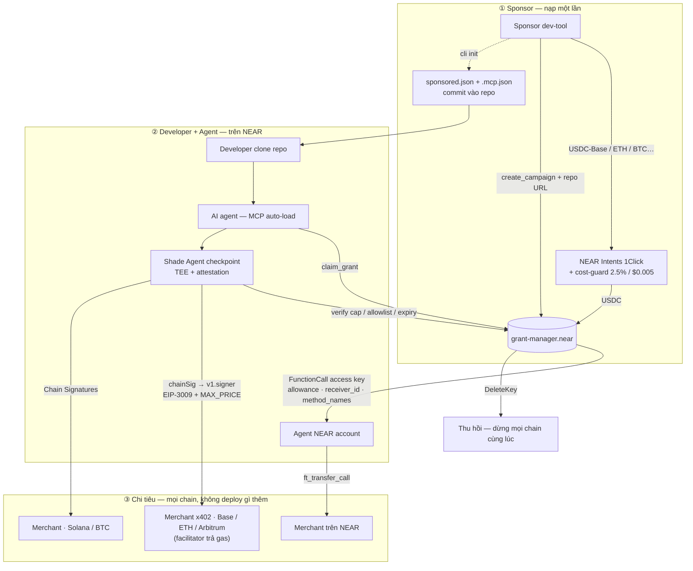

# Đề xuất xây dựng: Sponsored Compute trên NEAR

**Credit hạ tầng ràng buộc mục đích, cấp cho AI agent thay vì cho con người.**

> **Trạng thái:** Đề xuất — chờ phê duyệt · **Ngày:** 20/08/2026
> **Ngân sách phát triển:** **600 USD** (chi phí làm ra sản phẩm — không bao gồm vốn lưu động và chi phí vận hành, xem §11.2)
> **Thời gian:** 6 tuần (part-time) · **Chain:** NEAR (mainnet + testnet)

---

## 1. Tóm tắt điều hành

Sponsored Compute là hạ tầng để một **nền tảng dev-tool ký quỹ tiền tài trợ chi phí hạ tầng cho developer**, và để **AI agent của developer tiêu khoản đó theo mức dùng** — có trần chi, có hạn dùng, chỉ tiêu được ở nơi được phép, và thu hồi được bất cứ lúc nào.

Xây trên NEAR vì NEAR là chain duy nhất có **sẵn ở tầng giao thức** đúng những ràng buộc mà sản phẩm này cần. Một `FunctionCall` access key mang sẵn:

```
allowance     → trần chi cứng
receiver_id   → chỉ gọi được đúng một hợp đồng
method_names  → chỉ gọi được đúng những hành động cho phép
DeleteKey     → thu hồi tức thì, một giao dịch
nonce         → chống replay ở tầng chain
```

Trên bất kỳ chain nào khác, bốn dòng trên là hàng nghìn dòng smart contract phải viết, phải audit, và phải chịu trách nhiệm. Trên NEAR chúng là **runtime của chain**. Với ngân sách 600 USD — không đủ thuê audit — đây là lý do kỹ thuật quyết định, không phải sở thích.

Cộng thêm **Chain Signatures**: khoản tài trợ sống trên NEAR nhưng **tiêu được ở Base, Ethereum, Solana, Bitcoin** mà dự án không deploy một dòng hợp đồng nào trên các chain đó.

> **"Sponsor nạp một lần trên NEAR. Agent tiêu ở mọi chain. Sponsor xoá một access key là dừng được tất cả."**

Dự án không xây từ số không: hai codebase đã chạy được phủ phần khó nhất (§5).

---

## 2. Vấn đề

**2.1 — Developer ở Đông Nam Á có kỹ năng nhưng không trả được tiền hạ tầng.** Không có thẻ tín dụng quốc tế, vướng forex, bị ngân hàng chặn giao dịch xuyên biên giới, hoặc phí quy đổi ăn mòn khoản nhỏ. Đây là rào cản thật ở Việt Nam, Indonesia, Philippines.

**2.2 — Nền tảng dev-tool muốn tài trợ nhưng không có cách tài trợ an toàn.** Cấp credit dùng chung có lỗ hổng kinh tế chết người: *nếu nền tảng A tài trợ 50 USD mà dev tiêu ở nền tảng B, A được gì?* Mọi hệ điểm thưởng dùng chung đều chết vì lý do này. Credit phải **bị ràng buộc mục đích ngay lúc cấp**.

**2.3 — Giao tiền cho AI agent là rủi ro chưa ai giải đúng.** Agent tự cấp phát hạ tầng có đồng hồ đo, bằng tiền người khác, là công thức kinh điển để nhận hoá đơn bất ngờ. Database chạy 24/7 — hết credit rồi ai trả? Cần **trần cứng dừng luôn dịch vụ**, không phải chỉ dừng credit.

**2.4 — Và không ai verify được checkpoint.** Kể cả khi có lớp kiểm tra chính sách, nó chạy trên máy dev. Sponsor không có cách nào chứng minh nó đã thật sự kiểm tra allowlist, trần chi, hạn dùng. Phải tin lời.

---

## 3. Giải pháp

| Vấn đề | Cách giải trên NEAR |
|---|---|
| 2.1 — không trả được tiền hạ tầng | USDC + x402, trả theo mức dùng. Không thẻ, không tài khoản, không forex |
| 2.2 — credit dùng chung bị rò rỉ | `receiver_id` + `method_names` của access key — chỉ tiêu được ở merchant được cấp phép |
| 2.3 — hoá đơn phình không kiểm soát | `allowance` là trần cứng ở tầng chain; cảnh báo 80%/95%; hết trần → **dừng dịch vụ** |
| 2.4 — checkpoint không verify được | **Shade Agent** chạy trong TEE, code hash đăng ký on-chain, hợp đồng chỉ nhận lệnh từ enclave đã attest |

### Ba luật liêm chính của danh sách — không thương lượng

Nếu agent gợi ý tool mà có tiền phía sau, ta đang bán lòng tin, và lòng tin chỉ bán được một lần.

1. **Luôn hiện cả lựa chọn KHÔNG tài trợ**, đánh dấu rõ: *"3 có tài trợ · 2 không"*
2. **Không bao giờ bán thứ hạng** — xếp theo độ phù hợp kỹ thuật, tài trợ chỉ là một nhãn
3. **Chỉ hiện danh sách khi USER hỏi** — agent không tự tạo ra nhu cầu

Ba luật này áp cho **danh sách đã hợp nhất từ cả ba nguồn** (§5.3), không riêng phần của ta. Đây là tài sản duy nhất của sản phẩm.

---

## 4. Vì sao NEAR

### 4.1 Purpose-bound money là tính năng có sẵn
Xem §1. Hệ quả trực tiếp: hợp đồng cần viết nhỏ hơn một bậc độ lớn, đủ nhỏ để review kỹ trong ngân sách 600 USD.

### 4.2 Chain Signatures — một tài khoản NEAR, ví trên mọi chain
Hợp đồng MPC `v1.signer` cho phép tài khoản NEAR **ký giao dịch hợp lệ trên chain khác** mà không giữ private key chain đó. Địa chỉ Base/ETH/Solana/BTC được **suy ra tất định** từ `(near_account_id, derivation_path)`.

- Merchant nói x402 chuẩn trên Base → agent NEAR **ký EIP-3009 cho họ**. Ta không deploy gì trên Base.
- Grant bị thu hồi trên NEAR → **quyền ký trên mọi chain mất theo ngay lập tức**.
- Không bridge, không wrap, không tài sản mắc kẹt.

> Trên kiến trúc EVM thuần, thu hồi một grant nghĩa là phải **tin** rằng key đó không bị copy đi chỗ khác. Trên NEAR, quyền ký *là* access key — xoá key là xong. Đây là khác biệt về bản chất, không phải về mức độ.

### 4.3 NEAR Intents — sponsor nạp tài sản gì cũng được
1Click API + solver relay hỗ trợ **30+ chain** (`near eth base sol arb op pol bsc btc doge ltc zec xrp sui aptos ton stellar…`), luỹ kế vượt **6 tỷ USD** (04/2026). Nền tảng sponsor nạp **tài sản họ đang có** — rào cản onboarding gần như bằng không. `ONE_CLICK_JWT` (miễn phí, chỉ cần đăng ký) giảm phí swap.

### 4.4 `ft_transfer_call` — trả tiền và kích hoạt dịch vụ trong một giao dịch
NEP-141 chuyển token **và** gọi hàm merchant nguyên tử. Merchant hoặc nhận tiền và chạy, hoặc revert cả hai. Không cần facilitator, webhook, hay bảng nonce chống replay trong database.

⚠️ Vận hành: trước `ft_transfer` phải gọi `storage_deposit` trên token contract cho địa chỉ nhận — đúng **0.00125 NEAR** (`1250000000000000000000` yocto). Đã đăng ký rồi thì là no-op.

### 4.5 Gas: hai leg, và leg EVM không cần gì cả

| Leg | Agent cần gì | Ai trả gas |
|---|---|---|
| **x402 trên Base/EVM** | Chỉ một chữ ký EIP-712 off-chain | **x402 facilitator** — agent không cần ETH, ta không cần relayer |
| **Hợp đồng trên NEAR** (`claim_grant`, `ft_transfer_call`) | Gọi hàm on-chain | **Meta-tx NEP-366** — relayer của ta trả gas NEAR |

Skill chính thức của NEAR ghi rõ: *"No ETH needed — you sign off-chain only. The x402 facilitator submits the on-chain transaction and covers gas."* Relayer ta tự chạy **chỉ phục vụ leg NEAR** — nhỏ và rẻ.

### 4.6 Dòng tiền hệ sinh thái đúng chỗ
NEAR Foundation 2026 ưu tiên hẳn **AI × blockchain**: agent tự trị on-chain, AI verifiable, chain abstraction — grant **10k–100k USD** theo milestone, cộng **NEAR Horizon** (accelerator không lấy cổ phần, tới 50k Horizon Credits). Dự án nằm đúng giữa ba từ khoá đó.

---

## 5. Nền móng đã có — không xây từ số không

### 5.1 `NearDeFi/agent-payments-skill` — skill x402 chính thức của NEAR

Cài: `npx skills add NearDeFi/agent-payments-skill`

| Có sẵn | Dùng vào việc gì |
|---|---|
| `search-services.mjs` — x402-list + Coinbase bazaar | Nguồn danh sách dịch vụ (§5.3) |
| `check-price.mjs` — đọc challenge 402 **không trả tiền** | Xem giá trước, đối chiếu trần grant |
| `pay.mjs --max-price` / awal `--max-amount` | Trần cứng **tại thời điểm trả**, fail-closed |
| `cost-guard.mjs` — chặn swap nếu overhead > **2.5% VÀ $0.005** | Áp cho luồng nạp của sponsor |
| `near-intents.mjs` — `tokens` / `quote` / `status` | Nạp đa chain, có polling + refund |
| Managed-signer template (wallet-agnostic) | Điểm ghép quan trọng nhất — §5.3 |

**Triết lý trùng khớp:** *"Never pay through a mechanism that cannot enforce the confirmed price as a hard cap at payment time."* Đây đúng là luật checkpoint của ta, do chính team NEAR viết ra.

### 5.2 `kurodenjiro/Anyone-pay` — x402 trên NEAR, đã chạy

| File | Nội dung | Giá trị |
|---|---|---|
| `lib/chainSig.ts` (403 dòng) | `deriveAddressAndPublicKey()`, `signTypedDataWithChainSignature()`, **`signX402TransactionWithChainSignature()`** — ký EIP-3009 qua `v1.signer` | ⭐ Phần khó nhất của §4.2, đã xong |
| `lib/kdf.ts` (251 dòng) | Suy địa chỉ tất định từ NEAR account | Tái dùng nguyên |
| `lib/oneClick.ts` (179 dòng) | `@defuse-protocol/one-click-sdk-typescript` | Tái dùng nguyên |
| `contract/src/lib.rs` (165 dòng) | `near-sdk` Rust — `create_intent`, `verify_deposit`, `execute_x402_payment`, callback `#[private]` | Khung sườn `grant-manager.near` |
| `app/api/relayer/*` | `register-deposit`, `check-deposit`, `submit-tx-hash`, cron Vercel | Khung relayer |
| `lib/serviceRegistry.ts` | Supabase **pgvector** semantic search | Registry dịch vụ |
| `lib/nearAI.ts` | NEAR AI Cloud — phân tích intent | Tái dùng |

⚠️ **Nợ kỹ thuật:** `near-api-js ^0.44.2` và `ethers ^5.7.2` đều là bản cũ. Nâng lên `near-js` hiện hành + `ethers v6`/`viem` — tính **1.5 ngày**, làm trước khi ghép.

### 5.3 🔴 Điểm ghép quyết định — và cái bẫy phải tránh

Skill của NearDeFi nạp tiền vào một **ví Base riêng biệt** (awal / CDP / Privy / raw key). Dùng như hướng dẫn mặc định sẽ phá vỡ đúng tính chất mạnh nhất của kiến trúc:

> **Khi USDC đã nằm trong ví Base riêng đó, nó ra khỏi tầm kiểm soát của grant. Sponsor `DeleteKey` không dừng được nó nữa.**

**Cách vá — sạch, không phải hack.** Tài liệu skill nói rõ managed-signer template là wallet-agnostic: *"any wallet that can produce an EIP-712 typed-data signature plugs in as the `signTypedData` body."* Và `Anyone-pay/lib/chainSig.ts` có sẵn đúng hàm đó:

```
managed-signer template  (agent-payments-skill)
        signTypedData:  ←── signTypedDataWithChainSignature()   (Anyone-pay)
                                     │
                             v1.signer MPC trên NEAR
                                     │
                        địa chỉ Base suy ra từ NEAR account
```

- ✅ **Không tồn tại ví Base riêng** — địa chỉ Base suy ra từ tài khoản NEAR của agent
- ✅ **Tiền không rời tầm kiểm soát của grant** — `DeleteKey` vẫn dừng được chi tiêu EVM
- ✅ **Hai lớp trần chồng nhau:** `MAX_PRICE` fail-closed lúc trả **+** trần on-chain của grant
- ✅ Vẫn hưởng toàn bộ máy móc x402 của skill

**Ba nguồn danh sách hợp nhất:** x402-list · Coinbase bazaar · registry sponsor của ta. Ba luật liêm chính (§3) áp cho danh sách đã hợp nhất.

---

## 6. Kiến trúc



**Nguyên tắc:** hợp đồng trên NEAR giữ toàn bộ thẩm quyền. Supabase và web registry chỉ phục vụ tra cứu và hiển thị lịch sử — không thứ nào tự tạo được một grant hợp lệ.

**MCP tools — chốt cứng:**
```ts
list_sponsored_platforms(category)   // đọc
check_project_sponsorship()          // đọc
get_grant_status()                   // đọc
claim_sponsored_grant()              // tác động ngoài — cần user duyệt
pay_for_service(url, max_amount)     // tác động ngoài — cần user duyệt
```

**Ba điều cấm:**
1. **Không expose `unwrap` / `sign` / `check_policy` thành MCP tool.** Checkpoint nằm **bên trong** `pay_for_service`.
2. **Không tool nào trả private key.** Không `sign_anything`.
3. **Không claim grant trong `postinstall`** — chỉ được in một dòng.

---

## 7. Phạm vi

### Làm trong v1
- Hợp đồng `grant-manager.near`: campaign, nạp quỹ, claim, thu hồi
- Cấp Function Call Access Key ràng buộc theo campaign
- MCP server 5 tool, checkpoint trong TEE
- Thanh toán: `ft_transfer_call` trên NEAR + x402 trên Base qua Chain Signatures
- Console sponsor + dashboard merchant (Next.js)
- Nạp đa chain qua 1Click, có cost-guard
- Demo: 1 merchant NEAR, 1 merchant x402 Base, 1 chain non-EVM

### **Không** làm trong v1
- ❌ Ledger credit riêng — credit **chính là** USDC, không quy đổi, không vòng đóng
- ❌ Thanh toán fiat, thẻ ảo, on/off-ramp
- ❌ Merchant tự đăng ký không kiểm duyệt — allowlist thủ công
- ❌ Nhiều sponsor trên cùng một campaign
- ❌ Mobile app
- ❌ Token của dự án

---

## 8. Refactor giao diện

### 8.1 Hiện trạng — đo được, không phải cảm tính

| Chỉ số | Hiện tại | Vấn đề |
|---|---|---|
| `app/sponsor/page.tsx` | **448 dòng**, một `'use client'` duy nhất | Toàn bộ trang là client component: fetch, state, form, render trộn chung |
| `app/page.tsx` | **225 dòng**, cũng `'use client'` | Không tận dụng được React Server Components của Next 15 |
| `app/globals.css` | **311 dòng** viết tay, **60+ tên class tự đặt** | `.grant-radar`, `.handoff-card`, `.composer-demo`… — không hệ thống, không tái dùng, sửa một chỗ vỡ chỗ khác |
| `components/ui/*` | 5 file, **mỗi file 5 dòng** | Chỉ là wrapper nối thêm chuỗi class (`ui-button`, `ui-card`) — vỏ design-system rỗng ruột |
| Thư viện UI | **Không có** | Không Tailwind, không component lib, không design token có cấu trúc |
| Lớp ví | `viem` (EVM) | Không dùng được cho NEAR |

**Nợ nghiêm trọng nhất — kiểu dữ liệu domain sai ngay trong component:**

```ts
// app/page.tsx — type Grant
symbol: 'XSGD' | 'AVAX';     // ← union đóng cứng, không mở rộng được
chainId: number;             // ← giả định EVM
asset: 0 | 1;                // ← enum vô nghĩa
```

Đây không phải lỗi trình bày mà là **mô hình domain rò rỉ vào tầng giao diện**. Không sửa thì mọi màn hình mới đều kế thừa giả định sai.

### 8.2 Vì sao phải refactor, không phải "sửa dần"

Sản phẩm trên NEAR có **những màn hình mà bản hiện tại không có chỗ để đặt vào**:

| Màn hình mới | Vì sao cần | Không có sẵn |
|---|---|---|
| **Chi tiêu đa chain** | Một grant tiêu ở NEAR + Base + Solana — phải xem được ở đâu bao nhiêu | ❌ |
| **Thu hồi (`DeleteKey`)** | Màn demo chính (§10 tiêu chí 1) — sponsor bấm một nút, ba chain dừng | ❌ |
| **Trạng thái attestation TEE** | Chứng minh checkpoint chạy trong enclave đã đăng ký (§3, vấn đề 2.4) | ❌ |
| **Nạp qua 1Click** | Cần QR, số tiền chính xác, **đồng hồ đếm ngược deadline 2 giờ** | ❌ |
| **Danh sách dịch vụ hợp nhất** | 3 nguồn + nhãn "có tài trợ / không" theo ba luật liêm chính (§3) | ❌ |
| **Kết nối ví NEAR** | wallet-selector thay `viem` | ❌ |

Nhồi 6 màn hình này vào 311 dòng CSS viết tay và một component 448 dòng là cách chắc chắn nhất để tuần 5–6 vỡ tiến độ.

### 8.3 Phạm vi refactor

**Nền tảng**
- [ ] **Chọn Tailwind**, giữ bảng màu `--sc-*` hiện có làm design token *(khuyến nghị — xem §8.4)*
- [ ] Xoá `components/ui/*` stub, thay bằng primitive thật: `Button`, `Card`, `Input`, `Badge`, `Table`, `Dialog`, `Toast`
- [ ] Tách domain type ra `src/types/` — `accountId`, `assetId` (NEP-141), `destinationChain` thay cho `symbol`/`chainId`/`asset`
- [ ] Lớp ví: `viem` → **NEAR wallet-selector**, bọc sau một hook `useNearAccount()` duy nhất

**Cấu trúc**
- [ ] Bổ đôi `sponsor/page.tsx` (448 dòng): Server Component lấy dữ liệu + Client Component chỉ cho phần tương tác
- [ ] Chuyển fetch dữ liệu sang RSC, bỏ `useEffect` fetch ở cả 3 trang
- [ ] Chuẩn hoá loading / error / empty state — hiện mỗi trang tự làm một kiểu

**Màn hình mới** (§8.2) — 6 màn

**Chất lượng**
- [ ] Responsive: hiện chỉ chạy được trên desktop
- [ ] Dark/light: hiện hard-code dark
- [ ] Accessibility cơ bản: focus ring, `aria-label`, tương phản đạt WCAG AA
- [ ] Sửa `metadata.title` — vẫn còn ghi tên tài sản cũ

### 8.4 Khuyến nghị: Tailwind

| | **Tailwind** ✅ | Giữ CSS viết tay | Component lib nặng (MUI…) |
|---|---|---|---|
| Agent viết code | 🟢 Rất hợp — không phải đặt tên class | 🔴 Phải nhớ 60+ tên class | 🟡 Được |
| Đồng bộ với `Anyone-pay` | 🟢 Repo đó **đã dùng Tailwind** | 🔴 Lệch | 🔴 Lệch |
| Giữ được bảng màu hiện tại | 🟢 Đưa `--sc-*` vào `theme.extend` | 🟢 | 🔴 Phải theo theme của lib |
| Kích thước bundle | 🟢 Nhỏ | 🟢 Nhỏ nhất | 🔴 Lớn |
| Công di trú | 🟡 2 ngày | 🟢 0 | 🔴 4+ ngày |

Bảng màu tối/xanh chanh hiện tại (`--sc-accent: #c8ff45`) **giữ nguyên** — nó riêng biệt và dùng được. Refactor là đổi cách tổ chức, không đổi nhận diện.

### 8.5 Không làm trong v1
- ❌ Đổi nhận diện thương hiệu / logo mới
- ❌ Animation phức tạp (framer-motion) — trừ đồng hồ đếm ngược ở màn nạp
- ❌ Đa ngôn ngữ (i18n)
- ❌ Storybook / visual regression test

## 9. Kế hoạch 6 tuần

### Tuần 0 — Spike & cổng quyết định (3 ngày)
- [ ] Testnet: Function Call Access Key có `allowance` + `method_names` — xác nhận chain **chặn đúng** khi vượt trần
- [ ] Testnet: `ft_transfer_call` USDC (nhớ `storage_deposit` 0.00125 NEAR)
- [ ] Testnet: relayer meta-tx trả gas thay agent
- [ ] Chạy lại `Anyone-pay/lib/chainSig.ts` — xác nhận `signX402TransactionWithChainSignature()` còn hoạt động, **đo độ trễ và phí ký**
- [ ] `npx skills add NearDeFi/agent-payments-skill`, chạy `check-price.mjs` trên endpoint thật
- [ ] Xin `ONE_CLICK_JWT` + key NEAR AI Cloud
- [ ] Đặt lịch buổi hỗ trợ 1-1 hàng tuần của NEAR (Chain Signatures & Shade Agents)
- **🚦 Cổng:** qua hết → đi tiếp. Trượt vì Rust → hợp đồng dùng **near-sdk-js**, vẫn NEAR-native

### Tuần 1–2 — Hợp đồng & cấp grant
- [ ] `grant-manager.near` (khung từ `Anyone-pay/contract`): `create_campaign`, `fund`, `claim_grant`, `revoke`, `get_grant`
- [ ] Logic cấp access key theo campaign — allowlist merchant, hạn dùng, trần chi
- [ ] Trả nợ kỹ thuật: `near-api-js` → `near-js`, `ethers` v5 → v6/viem
- [ ] Test `near-workspaces`, deploy testnet, seed campaign mẫu

### Tuần 2–3 — Ghép skill + Chain Signatures *(rủi ro cao nhất)*
- [ ] Port `chainSig.ts` + `kdf.ts` + `oneClick.ts`
- [ ] **Cắm `signTypedDataWithChainSignature` vào managed-signer template** (§5.3)
- [ ] Xác minh: **không tồn tại ví Base riêng nào** — đưa thành test CI
- [ ] Xác minh **hai lớp trần** cùng chặn
- [ ] Merchant API trên NEAR trả HTTP 402, verify bằng receipt `ft_transfer_call`
- [ ] Cảnh báo 80% / 95%; hết trần → **dừng dịch vụ**
- [ ] Hợp nhất 3 nguồn danh sách + áp ba luật liêm chính
- [ ] **UI — nền tảng (§8.3):** dựng Tailwind + token, xoá `ui/*` stub, tách domain type, `useNearAccount()`. *Chạy song song, không chặn hợp đồng*

### Tuần 3–4 — Shade Agent / TEE
- [ ] Đưa checkpoint vào TEE, publish code hash lên `grant-manager.near`
- [ ] Hợp đồng chỉ nhận lệnh chi từ enclave đã attest
- [ ] Test tấn công: merchant độc hại prompt-inject agent

### Tuần 4–5 — Đa chain & màn demo chính
- [ ] Trả cho merchant x402 thật trên **Base** — không deploy gì trên Base
- [ ] Ký thêm **một chain non-EVM** (Solana / Bitcoin) — chứng minh không phải trick riêng EVM
- [ ] Sponsor nạp USDC-Base → 1Click → cấp grant, có cost-guard
- [ ] ⭐ **Demo thu hồi:** sponsor `DeleteKey` → chi tiêu trên **cả ba chain** dừng cùng lúc

### Tuần 5–6 — Sản phẩm & phát hành
- [ ] **UI — cấu trúc:** bổ đôi `sponsor/page.tsx`, chuyển fetch sang RSC, chuẩn hoá loading/error/empty
- [ ] **UI — 6 màn hình mới (§8.2):** chi tiêu đa chain · thu hồi · attestation TEE · nạp 1Click có QR + đếm ngược · danh sách hợp nhất · kết nối ví NEAR
- [ ] **UI — chất lượng:** responsive, dark/light, focus ring + WCAG AA
- [ ] Deploy mainnet, campaign nhỏ với tiền thật
- [ ] `architecture.drawio`, README, docs, slide
- [ ] Video demo 3 phút — trục chính là màn thu hồi đa chain
- [ ] Nộp **NEAR Grants** (AI × chain abstraction) + **Horizon**

---

## 10. Định nghĩa hoàn thành

Dự án được coi là thành công khi **tất cả** những điều sau đúng:

| # | Tiêu chí | Cách đo |
|---|---|---|
| 1 | Sponsor nạp → agent claim → trả **3 merchant trên 3 chain** → `DeleteKey` dừng cả ba | Demo live trên mainnet, tx công khai trên Nearblocks |
| 2 | **Không tồn tại địa chỉ chi tiêu nào ngoài tầm `DeleteKey`** | Test CI tự động — có địa chỉ Base không suy ra từ NEAR account → fail |
| 3 | Vượt trần bị chặn ở **cả hai lớp** độc lập | Test: `MAX_PRICE` fail-closed + hợp đồng revert |
| 4 | Hết grant → **dịch vụ dừng**, không âm thầm tính tiền dev | Test tích hợp |
| 5 | Lệnh chi chỉ được chấp nhận từ enclave đã attest | Thử gửi lệnh từ ngoài TEE → hợp đồng từ chối |
| 6 | Hợp đồng Rust **dưới 400 dòng** | `wc -l` — nhỏ là yêu cầu, không phải may mắn |
| 7 | Merchant độc hại không lái được agent chi sai | Demo evil merchant |
| 8 | Hồ sơ NEAR Grants nộp được | Đã nộp |

---

## 11. Ngân sách

### 11.1 Ngân sách phát triển — 600 USD

Đây là tiền **làm ra sản phẩm**: công sức, công cụ, và chi phí kỹ thuật trong 6 tuần xây dựng. Không bao gồm vốn lưu động và chi phí vận hành (§11.2).

| # | Hạng mục | Chi tiết | USD | % |
|---|---|---|---|---|
| 1 | **AI coding agent — lõi** | Hợp đồng Rust, backend, port TS, test — 6 tuần | **220** | 37% |
| 2 | **AI coding agent — refactor giao diện** | §8: nền tảng + cấu trúc + 6 màn hình mới | **70** | 12% |
| 3 | **Review hợp đồng Rust** | Thuê ngoài 3–4 giờ đọc `grant-manager.near` **trước khi lên mainnet** | **120** | 20% |
| 4 | Gas & deploy | Deploy lại nhiều lần (testnet + mainnet), storage staking, `storage_deposit` | 45 | 8% |
| 5 | NEAR AI Cloud + embeddings | Phân tích intent + OpenAI embeddings cho pgvector | 45 | 8% |
| 6 | RPC dev tier | FastNEAR/Intear + `BASE_RPC_KEY` — 2 tháng | 30 | 5% |
| 7 | Công cụ scan bảo mật | Static analysis cho contract Rust | 20 | 3% |
| 8 | **Dự phòng** | Deploy lại, spike hỏng, đổi hướng ở cổng tuần 0 | **50** | 8% |
| | **TỔNG** | | **600** | 100% |

**Vì sao chia như vậy:**

- **Mục 1+2 gộp lại là 48%, và đúng phải như vậy.** Với một người làm part-time, chi phí phát triển thật của dự án 2026 nằm ở inference của agent, không phải ở license phần mềm. Cắt mục này là cắt thẳng vào tốc độ.
- **Mục 3 không được cắt.** Ngân sách này không đủ thuê audit đầy đủ, nên biện pháp bảo mật thay thế là *hợp đồng dưới 400 dòng* (§10 tiêu chí 6) **cộng** một cặp mắt bên ngoài đọc nó. Bỏ mục 3 là lên mainnet với code chưa ai ngoài đội nhìn qua.
- **Mục 2 (refactor UI) là khoản mới**, lấy từ việc siết mục 4–7. Đây là đánh đổi thật, không phải tiền từ trên trời: **dự phòng tụt 10% → 8%** và ngân sách công cụ scan giảm còn 20 USD.
- **Nếu 600 USD không co thêm được nữa**, hai lựa chọn — cắt mục 2 xuống 6 màn hình còn 3 (bỏ attestation TEE, dark/light, responsive), **hoặc** kéo lịch thành **7 tuần** thay vì 6. Khuyến nghị: kéo lịch, vì 3 màn bị cắt đều nằm trong màn demo chính.

### 11.2 Ngoài ngân sách phát triển — cần nguồn riêng

Những khoản này **không phải chi phí phát triển**, nhưng vẫn cần có thì mới demo được trên mainnet:

| Hạng mục | USD | Tính chất | Cắt được không |
|---|---|---|---|
| Vốn lưu động USDC cho campaign demo | 120 | **Thu hồi được** — không phải chi phí, là vốn | Giảm còn ~30 nếu demo số nhỏ |
| Shade Agent TEE hosting (2 tháng, từ tuần 3) | 60 | Chi phí vận hành | ✅ Hoãn sang giai đoạn 2 (R5) |
| Vercel + tên miền (1 năm) | 40 | Chi phí vận hành | ✅ Free tier + subdomain `.vercel.app` |
| Dựng video demo & asset slide | 60 | Truyền thông | ✅ Tự dựng |
| **Tổng** | **280** | *(chi thật 160 sau khi rút vốn)* | **Tối thiểu ~30** |

**Kịch bản tối thiểu:** nếu không có nguồn nào ngoài 600 USD, cắt hết §11.2 xuống còn **~30 USD vốn lưu động** — demo mainnet với số tiền rất nhỏ, TEE hoãn sang giai đoạn 2, hosting free tier, video tự dựng. Sản phẩm vẫn chạy và vẫn đạt 7/8 tiêu chí §10 (mất tiêu chí 5 — attestation TEE).

> ⚠️ **Nếu 600 USD buộc phải gánh cả §11.2**, khoản bị ép xuống sẽ là mục 1 (AI agent) hoặc mục 2 (review hợp đồng). Cả hai đều là lựa chọn tồi: một cái làm chậm tiến độ, một cái đẩy code chưa review lên mainnet. Cần chốt nguồn cho §11.2 **trước tuần 0** (§13).

### 11.3 Nguyên tắc chi

- **Testnet miễn phí** — chỉ mở chi mainnet (mục 3) sau khi qua cổng tuần 0
- **Không mua ETH** cho leg x402 — facilitator trả gas (§4.5)
- **Không chi cho marketing.** Kênh phân phối là NEAR Grants + Horizon
- Xin `ONE_CLICK_JWT` (miễn phí) ngay tuần 0 để giảm phí swap
- Mục 4 và 5 chi theo tháng — **cắt được ngay** nếu chậm tiến độ

## 12. Rủi ro

| # | Rủi ro | Mức | Giảm thiểu |
|---|---|---|---|
| R1 | **Ghép skill sai cách → tiền ra khỏi tầm kiểm soát của grant** (§5.3) | 🔴 Cao | **Cấm** dùng ví Base riêng làm nguồn tiền của grant. Bắt buộc qua managed-signer + Chain Signatures. Đưa thành test CI (§10 tiêu chí 2) |
| R2 | Đội chưa quen Rust, 6 tuần có thể trượt | 🔴 Cao | Cổng tuần 0 + đã có khung contract. Trượt → **near-sdk-js**, vẫn NEAR-native |
| R3 | Nợ kỹ thuật khi port (`near-api-js` 0.44, `ethers` v5) | 🟡 TB | Tính riêng 1.5 ngày ở tuần 1–2. Làm trước khi ghép, không song song |
| R4 | Chain Signatures trễ / phí ký cao hơn dự kiến | 🟡 TB | Đo ngay ở spike tuần 0 (code đã có). Nếu chậm → luồng nóng là merchant NEP-141 trên NEAR, đa chain thành tính năng chứng minh |
| R5 | Shade Agent / TEE mới, tài liệu mỏng | 🟡 TB | Buổi hỗ trợ 1-1 hàng tuần của NEAR. Đường lui: checkpoint local, TEE thành giai đoạn 2 |
| R6 | Skill NearDeFi đổi API, vỡ tích hợp | 🟡 TB | Pin phiên bản; bọc lời gọi sau một adapter mỏng trong `src/`, không gọi rải rác |
| R7 | Usage định kỳ phình vượt trần (database chạy 24/7) | 🟡 TB | Trần cứng **dừng dịch vụ** chứ không chỉ dừng credit; cảnh báo 80%/95%; usage phải gắn với dự án thật |
| R8 | **Refactor UI phình scope** — dễ trượt thành đổi nhận diện | 🟡 TB | §8.5 liệt kê rõ cái **không** làm. Giữ nguyên bảng màu `--sc-*`. Nền tảng UI (§8.3) làm ở tuần 2–3 **song song**, không chặn hợp đồng |
| R9 | Grant NEAR không được duyệt | 🟡 TB | Prototype tự đứng được. Nộp song song Horizon và hackathon NEAR |

---

## 13. Cần chốt trước khi bắt đầu

- [ ] **Ai viết Rust?** Học 1 tuần trước tuần 0, hay đi thẳng `near-sdk-js`?
- [ ] **Repo nền:** xây mới và port code từ Anyone-pay sang, hay xây **lên trên** Anyone-pay? *(repo đó đã có Next.js + Supabase + relayer + cron chạy sẵn — nhanh hơn, đổi lại phải sống với nợ kỹ thuật của nó)*
- [ ] **Nguồn cho §11.2 (280 USD ngoài ngân sách phát triển)?** Có nguồn riêng, hay chạy kịch bản tối thiểu ~30 USD? *(phải chốt trước tuần 0 — nó quyết định TEE có nằm trong v1 không)*
- [ ] Ngân sách phát triển 600 USD là **cứng**, hay xin thêm được nếu qua cổng tuần 0?
- [ ] Mục tiêu cuối là **hồ sơ grant NEAR** hay **sản phẩm có người dùng thật**? *(khác nhau rõ ở tuần 5–6)*
- [ ] Chain non-EVM demo tuần 4–5: **Solana** (nhanh, nhiều merchant), **Bitcoin** (ấn tượng hơn), hay **Zcash** (Anyone-pay đã làm)?
- [ ] **Tailwind hay giữ CSS viết tay?** *(khuyến nghị Tailwind — §8.4; nếu giữ CSS thì mục 2 ngân sách giảm ~20 USD nhưng agent viết UI chậm hơn)*
- [ ] Merchant demo đầu tiên là ai? Cần ít nhất một dịch vụ x402 thật đang chạy trên Base

---

## 14. Nguồn tham khảo

**Codebase nền móng**
- [NearDeFi/agent-payments-skill](https://github.com/NearDeFi/agent-payments-skill) — skill x402 chính thức của NEAR
- [kurodenjiro/Anyone-pay](https://github.com/kurodenjiro/Anyone-pay) — x402 + Chain Signatures + 1Click, đã chạy
- [chainsig.js](https://www.npmjs.com/package/chainsig.js) · [one-click-sdk-typescript](https://github.com/defuse-protocol/one-click-sdk-typescript)

**Tài liệu**
- [Shade Agents — NEAR Documentation](https://docs.near.org/ai/shade-agents/getting-started/introduction)
- [Shade Agents: The First Truly Autonomous AI Agents — NEAR](https://www.near.org/blog/shade-agents-the-first-truly-autonomous-ai-agents)
- [1Click Swap API — NEAR Intents Docs](https://docs.near-intents.org/near-intents/integration/distribution-channels/1click-api)
- [Solver Relay API — NEAR Intents Docs](https://docs.near-intents.org/near-intents/market-makers/bus/solver-relay)
- [near-intents-agent-example — near-examples](https://github.com/near-examples/near-intents-agent-example)
- [Get Funding — NEAR Protocol](https://pages.near.org/ecosystem/get-funding/)
