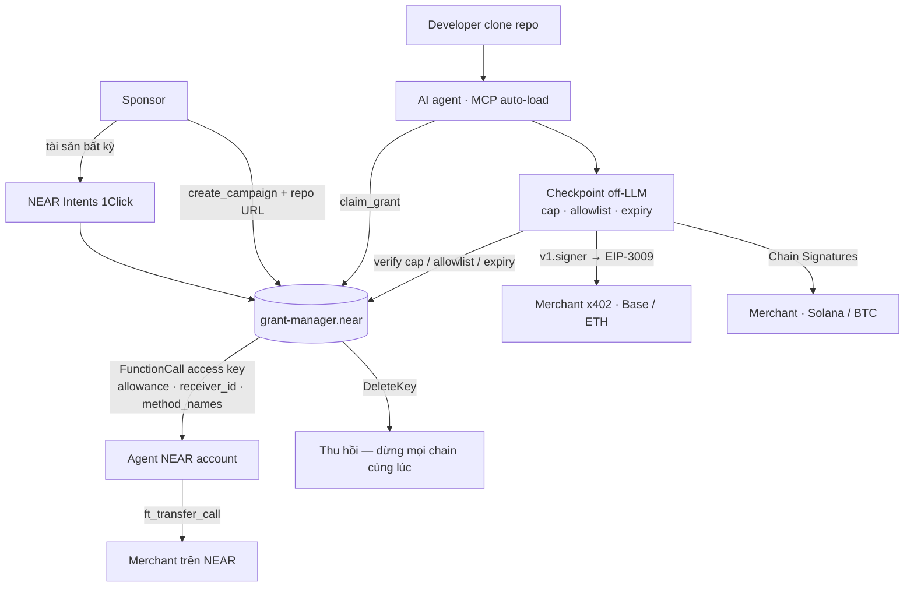

# Đề xuất xây dựng: Sponsored Compute trên NEAR

**Credit hạ tầng ràng buộc mục đích, cấp cho AI agent thay vì cho con người.**

> **Ngân sách phát triển:** 600 USD · **Thời gian:** 6 tuần (part-time) · **Chain:** NEAR
> Bản chi tiết: [PROPOSAL-NEAR-chi-tiet.md](PROPOSAL-NEAR-chi-tiet.md)

---

## 1. Tóm tắt

Nền tảng dev-tool ký quỹ tiền tài trợ chi phí hạ tầng cho developer. **AI agent của developer tiêu khoản đó theo mức dùng** — có trần chi, có hạn dùng, chỉ tiêu được ở nơi được phép, thu hồi được bất cứ lúc nào.

Xây trên NEAR vì một `FunctionCall` access key **đã có sẵn** đúng những ràng buộc sản phẩm cần:

```
receiver_id   → chỉ gọi được đúng một hợp đồng
method_names  → chỉ gọi được đúng những hành động cho phép
allowance     → trần gas; hết là key ngừng hoạt động
DeleteKey     → thu hồi tức thì, một giao dịch
```

Và quan trọng nhất: **function-call access key không đính kèm được NEAR** — nó không tự chuyển tiền được, chỉ gọi được đúng một hàm của đúng một hợp đồng. Trên chain khác, những ràng buộc này là hàng nghìn dòng smart contract phải viết và phải audit. Trên NEAR chúng là runtime của chain.

> ⚠️ **Đọc kỹ chỗ này khi triển khai:** `allowance` là **trần gas** (yoctoNEAR), **không phải** trần chi USDC. Trần chi tiền nằm trong state của `grant-manager.near`. Access key cho ta *ai được gọi gì*; hợp đồng cho ta *bao nhiêu*.

Cộng **Chain Signatures**: tiền sống trên NEAR nhưng tiêu được ở Base, Ethereum, Solana, Bitcoin mà **không deploy một dòng hợp đồng nào** trên các chain đó.

> **"Sponsor nạp một lần trên NEAR. Agent tiêu ở mọi chain. Sponsor xoá một access key là dừng được tất cả."**

---

## 2. Vấn đề

1. **Developer SEA không trả được tiền hạ tầng** — không thẻ tín dụng quốc tế, vướng forex, ngân hàng chặn giao dịch xuyên biên giới.
2. **Credit dùng chung bị rò rỉ** — nếu nền tảng A tài trợ mà dev tiêu ở B, A được gì? Credit phải bị ràng buộc mục đích ngay lúc cấp.
3. **Giao tiền cho agent là rủi ro chưa ai giải đúng** — database chạy 24/7, hết credit rồi ai trả? Cần trần cứng **dừng dịch vụ**, không phải chỉ dừng credit.
4. **Checkpoint không verify được** — lớp kiểm tra chính sách chạy trên máy dev; sponsor phải tin lời.

---

## 3. Vì sao NEAR

| | |
|---|---|
| **Access key** | Allowlist hợp đồng + hành động, thu hồi tức thì, không tự chuyển được tiền — có sẵn ở tầng giao thức (§1) |
| **Chain Signatures** (`v1.signer`) | Địa chỉ Base/ETH/Solana/BTC suy ra tất định từ tài khoản NEAR. Thu hồi trên NEAR → **quyền ký trên mọi chain mất theo ngay** |
| **NEAR Intents 1Click** | Sponsor nạp tài sản đang có, 30+ chain. Rào cản onboarding gần bằng không |
| **`ft_transfer_call`** | Nạp quỹ campaign contract-to-contract trong một giao dịch nguyên tử |
| **Grants** | NEAR Foundation 2026 ưu tiên AI × blockchain — 10k–100k USD theo milestone, cộng Horizon |

**Gas — agent không cần giữ token gas ở bất kỳ đâu:**

| Leg | Cơ chế | Ai trả gas |
|---|---|---|
| x402 trên NEAR (`near:`) | NEP-366 `SignedDelegate` + NEP-141 | **Facilitator** — trả cả gas NEAR **và** khoản deposit 1 yoctoNEAR |
| x402 trên Base (`eip155:8453`) | EIP-3009, ký qua Chain Signatures | **Facilitator** — agent chỉ ký off-chain, không cần ETH |

**Ta không phải tự chạy relayer nào cả** (§4).

> **Điểm mấu chốt:** trên kiến trúc EVM thuần, thu hồi grant nghĩa là phải *tin* rằng key đó không bị copy đi chỗ khác. Trên NEAR, quyền ký *là* access key — xoá key là xong. Khác biệt về bản chất, không phải mức độ.

---

## 4. Có nên dùng x402 không?

**Có — và mạnh hơn tôi tưởng lúc đầu.** x402 hỗ trợ **NEAR native**, không phải chỉ Base.

| | |
|---|---|
| Định danh mạng | `near:<network>` (CAIP-2), cả **mainnet và testnet** |
| Uỷ quyền | **NEP-366 `SignedDelegate`** |
| Chuyển tiền | **NEP-141** |
| Gas | **Facilitator trả gas NEAR + khoản deposit 1 yoctoNEAR.** Người trả chỉ mất đúng số token |

Ba hệ quả:

1. **x402 là đường thanh toán trên chính NEAR**, không phải cây cầu bắc sang Base. Câu hỏi "dùng x402 có phải là xây cho hệ sinh thái Coinbase không" — không, NEAR là một mạng hạng nhất trong x402.
2. **Cắt được relayer meta-tx của ta.** Facilitator đã sponsor gas NEAR. Bớt một dịch vụ phải viết, phải chạy, phải nạp tiền.
3. **Đây là lý do thật để dùng x402:** nó cho ta **merchant đã tồn tại sẵn**. Không có x402 thì tuần 4–5 không có ai để trả tiền — phải đi chiêu mộ từng merchant một.

### Hai ràng buộc phải biết trước

| Ràng buộc | Ảnh hưởng |
|---|---|
| **Facilitator mặc định của x402.org KHÔNG hỗ trợ NEAR** — chỉ facilitator production mới có | Phải chọn và xác minh một facilitator ngay **tuần 0**. Đây là dependency ngoài, không phải chi tiết |
| **Skill của NearDeFi chỉ chạy Base mainnet** — `BASE_MAINNET_CHAIN_ID = 8453 // only Base mainnet is supported (no testnets / other chains)` | Skill **không dùng được cho leg NEAR**, và không test được trên testnet. Ta lấy phần tìm dịch vụ + xem giá + cost-guard + luồng nạp; phần trả tiền trên NEAR tự viết |

### Dùng ở đâu, không dùng ở đâu

- ✅ **x402 cho mọi lượt trả tiền merchant** — trên NEAR và trên Base, cùng một giao thức, cùng một trải nghiệm agent
- ✅ `ft_transfer_call` **chỉ** cho nạp quỹ campaign (contract-to-contract, cần nguyên tử)
- ❌ **Không tự dựng facilitator.** Ngân sách 600 USD không gánh nổi

## 5. Nền móng đã có — không xây từ số không

| Nguồn | Cho ta cái gì |
|---|---|
| **[NearDeFi/agent-payments-skill](https://github.com/NearDeFi/agent-payments-skill)** — skill x402 chính thức của NEAR | Tìm dịch vụ (x402-list + bazaar), xem giá không trả tiền, trần chi fail-closed, cost-guard, luồng nạp 1Click |
| **[kurodenjiro/Anyone-pay](https://github.com/kurodenjiro/Anyone-pay)** — đã chạy | `chainSig.ts` ký EIP-3009 qua `v1.signer`, tích hợp 1Click, contract Rust làm khung, relayer + cron, pgvector search |

⚠️ Nợ kỹ thuật khi port: `near-api-js ^0.44.2` và `ethers ^5.7.2` đều là bản cũ — tính 1.5 ngày.

⚠️ Skill NearDeFi **chỉ chạy Base mainnet, không có testnet** (§4) — leg NEAR ta tự viết.

### 🔴 Cái bẫy phải tránh

Skill của NearDeFi nạp tiền vào một **ví Base riêng biệt**. Dùng như mặc định sẽ phá vỡ đúng tính chất mạnh nhất của kiến trúc:

> Khi USDC đã nằm trong ví Base riêng, nó **ra khỏi tầm kiểm soát của grant** — `DeleteKey` không dừng được nữa.

**Cách vá:** managed-signer template của skill là wallet-agnostic — cắm `signTypedDataWithChainSignature()` của Anyone-pay vào. Kết quả: không có ví Base riêng, địa chỉ Base suy ra từ NEAR account, `DeleteKey` vẫn dừng được chi tiêu EVM, và **hai lớp trần chồng nhau** (`MAX_PRICE` lúc trả + trần on-chain).

Đưa thành **test CI**: tồn tại địa chỉ Base không suy ra từ NEAR account → build fail.

---

## 6. Kiến trúc



Hợp đồng trên NEAR giữ toàn bộ thẩm quyền. Supabase và web chỉ để tra cứu và hiển thị.

**Ba luật liêm chính của danh sách** — áp cho danh sách hợp nhất từ cả 3 nguồn:
1. Luôn hiện cả lựa chọn **không** tài trợ, đánh dấu rõ
2. Không bao giờ bán thứ hạng
3. Chỉ hiện khi **user** hỏi

**Ba điều cấm:** không expose `unwrap`/`sign`/`check_policy` thành MCP tool · không tool nào trả private key · không claim grant trong `postinstall`.

---

## 7. Chống lạm dụng

Tiền của sponsor mà ai claim cũng được thì campaign bị vét trong một đêm. Đây là phần thiết kế, không phải phần vá sau.

### 7.1 Mô hình mối đe doạ

| | Kịch bản | Mức |
|---|---|---|
| **T1** | **Sybil claim** — một người, nhiều tài khoản/repo, claim đi claim lại cùng một campaign | 🔴 |
| **T2** | **Merchant thông đồng** — dev tiêu grant ở merchant của chính mình, merchant rút USDC → biến credit tài trợ thành tiền mặt | 🔴 |
| **T3** | Farm resource — provision hạ tầng chỉ để đốt credit | 🟡 |
| **T4** | Claim rồi bỏ — chiếm suất, sponsor không được gì | 🟡 |
| **T5** | Agent lặp vô hạn — không ác ý, nhưng đốt grant nhanh nhất | 🟡 |

**T2 là nguy hiểm nhất và purpose-binding một mình không chặn được** — vì merchant *nằm trong* allowlist.

### 7.2 Năm lớp phòng thủ

| Lớp | Cách làm | Chặn |
|---|---|---|
| **1. Khoá theo `(campaign, repo)`** | Grant gắn với **repo**, không phải tài khoản. Map on-chain, một repo một grant | T1, T4 |
| **2. Chứng minh quyền sở hữu repo** | Verifier **do sponsor chạy** (commit chứa nonce / GitHub OIDC) — sponsor là bên mất tiền, nên sponsor tự verify là đủ (§8) | T1 |
| **3. Ngưỡng repo do sponsor đặt** | Tuổi repo, số commit, số contributor — nâng chi phí tạo repo giả | T1, T3 |
| **4. ⭐ Cấp theo đợt (tranche)** | **Không cấp 50 USD một lần.** Cấp 5 USD, refill khi có usage thật | T1, T2, T3, T5 |
| **5. Merchant do sponsor duyệt + cửa sổ clawback** | Allowlist thủ công ở v1; sponsor thu hồi được trước khi merchant rút | T2 |

Cộng thêm hai thứ đã có sẵn: **rate limit trong checkpoint** (số call/giờ mỗi endpoint — chặn T5) và **`DeleteKey`** làm kill switch.

### 7.3 Nguyên tắc kinh tế

> **Giá trị rút được trên mỗi sybil phải nhỏ hơn chi phí tạo ra một sybil.**

Cấp theo đợt là biện pháp rẻ nhất đạt được điều đó: kẻ tấn công bỏ công tạo một repo đủ ngưỡng chỉ để lấy 5 USD. Không cần KYC, không cần chống sybil tuyệt đối — chỉ cần làm cho việc đó **không đáng**.

### 7.4 Thừa nhận giới hạn

- **Không KYC → không chặn được sybil quyết tâm.** Ta chọn *giới hạn thiệt hại* thay vì *chặn tuyệt đối*.
- **T2 ở v1 chỉ chặn được bằng kiểm duyệt thủ công** — không mở rộng được. Đây chính là lý do "merchant tự đăng ký không kiểm duyệt" nằm ngoài phạm vi v1.
- **Verify repo đặt off-chain, không đặt trong hợp đồng** — hợp đồng không gọi được GitHub, và nhét vào đó sẽ vượt mốc 400 dòng. Hợp đồng giữ sổ cái; sponsor giữ phần kiểm tra.

## 8. Vì sao **không** dùng TEE ở v1

Các bản trước của đề xuất này đặt checkpoint vào TEE (Shade Agent). Rà lại thì nó **không đứng vững cho v1**.

**TEE được cho là giải bài toán:** *"checkpoint chạy trên máy dev, sponsor không verify được nó đã kiểm tra trần chi / allowlist / hạn dùng."*

**Nhưng bài toán đó đã được giải ở chỗ khác:**

| Lập luận | |
|---|---|
| **Hợp đồng mới là thẩm quyền** | Trần chi, allowlist, hạn dùng đều nằm trong `grant-manager.near`. Agent bỏ qua checkpoint thì giao dịch **bị chain từ chối**. TEE không thêm gì ở đây |
| **Access key không tự chuyển được tiền** | Function-call access key không đính kèm được NEAR — nó chỉ gọi được đúng một hàm. Không có đường nào để một agent gian lận tự rút tiền |
| **TEE bảo đảm toàn vẹn code, không bảo đảm chất lượng quyết định** | Một LLM **bên trong** enclave vẫn bị prompt-injection như thường. TEE **không** chống được merchant độc hại — đó là lý do tôi từng ngầm viện đến nó, và nó sai |
| **Bên mất tiền là sponsor** | Phần duy nhất hợp đồng không thấy được là dữ kiện off-chain (quyền sở hữu repo, tuổi repo). Nhưng nếu **sponsor tự chạy verifier** thì không còn bài toán tin cậy nào để giải — họ đang tự bảo vệ tiền của mình |

**Cắt TEE khỏi v1 tiết kiệm:** ~5 ngày công · 60 USD hosting · một rủi ro (tài liệu Shade Agent còn mỏng). Số ngày đó chuyển sang refactor giao diện — đúng chỗ đang căng tiến độ.

**Khi nào TEE mới xứng đáng — giai đoạn 2:** khi merchant **tự đăng ký** và campaign thành **permissionless**. Lúc đó không còn bên nào đáng tin để chạy verifier, và attestation mới trả đủ chi phí của nó.

> ⚖️ **Một điểm ngược lại, nói cho công bằng:** TEE là câu chuyện mạnh trong hồ sơ NEAR Grants — quỹ 2026 ưu tiên "verifiable AI". Đó là lợi ích **truyền thông**, không phải lợi ích kiến trúc. Nếu mục tiêu ưu tiên là hồ sơ grant chứ không phải sản phẩm, hãy đưa TEE trở lại và chấp nhận kéo lịch sang tuần 7.

## 9. Refactor giao diện

Hiện trạng: `sponsor/page.tsx` **448 dòng** một client component · `globals.css` **311 dòng** viết tay với 60+ class tự đặt · `components/ui/*` là 5 file mỗi file 5 dòng, vỏ rỗng · không Tailwind, không design token.

Nợ nặng nhất là **domain model rò rỉ vào component** — `symbol: 'XSGD' | 'AVAX'`, `chainId: number`. Không sửa thì mọi màn hình mới đều kế thừa giả định sai.

**Cần 6 màn hình chưa có chỗ đặt vào:** chi tiêu đa chain · thu hồi `DeleteKey` · trạng thái grant + đợt cấp · nạp 1Click (QR + đếm ngược 2 giờ) · danh sách hợp nhất 3 nguồn · kết nối ví NEAR.

**Phạm vi:** chuyển Tailwind (giữ nguyên bảng màu `--sc-accent: #c8ff45`) · primitive thật thay stub · tách domain type · `viem` → NEAR wallet-selector · bổ đôi trang 448 dòng thành RSC + client · responsive + dark/light + WCAG AA.

**Không làm:** logo mới, animation phức tạp, i18n, Storybook.

---

## 10. Kế hoạch 6 tuần

| Tuần | Việc | Kết quả |
|---|---|---|
| **0** *(3 ngày)* | Spike: access key chặn đúng khi vượt trần · `ft_transfer_call` · chạy lại `chainSig.ts` đo độ trễ · cài skill NearDeFi · **chọn & xác minh facilitator hỗ trợ NEAR** (§4) · xin `ONE_CLICK_JWT` | **🚦 Cổng.** Trượt vì Rust → `near-sdk-js`, vẫn NEAR-native |
| **1–2** | `grant-manager.near`: campaign, nạp quỹ, claim, thu hồi, **cấp theo đợt + khoá `(campaign, repo)`** (§7) · cấp access key theo campaign · trả nợ kỹ thuật thư viện · test `near-workspaces` | Deploy testnet, campaign mẫu |
| **2–3** | **Ghép skill + Chain Signatures** *(rủi ro cao nhất)* · merchant API 402 · cảnh báo 80/95% · hợp nhất 3 nguồn danh sách · **verifier repo do sponsor chạy** (§7.2) · **UI nền tảng** (song song) | Test CI xác nhận không có ví Base riêng |
| **3–4** | **x402 trên NEAR**: `SignedDelegate` + NEP-141 qua facilitator · verifier repo do sponsor chạy · test merchant độc hại prompt-inject | Trả tiền trên NEAR qua x402 |
| **4–5** | Trả merchant x402 thật trên Base · ký thêm 1 chain non-EVM · nạp qua 1Click | ⭐ **Demo thu hồi:** `DeleteKey` → 3 chain dừng cùng lúc |
| **5–6** | UI: bổ đôi trang, 6 màn hình mới, responsive · deploy mainnet · docs + video 3 phút · nộp NEAR Grants + Horizon | Sản phẩm chạy trên mainnet |

**Định nghĩa hoàn thành** — 4 điều phải đúng: ① demo thu hồi 3 chain chạy trên mainnet · ② CI xác nhận không có địa chỉ chi tiêu nào ngoài tầm `DeleteKey` · ③ hết grant thì **dịch vụ dừng** · ④ hợp đồng Rust **dưới 400 dòng** *(nhỏ là yêu cầu, không phải may mắn — vì không có audit)*.

---

## 11. Ngân sách

### 11.1 Ngân sách phát triển — 600 USD

| Hạng mục | USD |
|---|---|
| **AI coding agent — lõi** (hợp đồng Rust, backend, port TS, test) | **200** |
| **AI coding agent — refactor giao diện** | **90** |
| **Review hợp đồng Rust** — thuê ngoài, trước khi lên mainnet | **120** |
| Gas & deploy (testnet + mainnet, storage staking) | 45 |
| NEAR AI Cloud + OpenAI embeddings | 45 |
| RPC dev tier (FastNEAR/Intear + Base) | 30 |
| Công cụ scan bảo mật | 20 |
| Dự phòng (8%) | 50 |
| **TỔNG** | **600** |

- **Agent chiếm 48%, và đúng phải như vậy** — chi phí phát triển thật của dự án 2026 nằm ở inference, không phải license.
- **Review hợp đồng không được cắt.** Không đủ tiền audit, nên biện pháp thay thế là hợp đồng dưới 400 dòng **cộng** một cặp mắt ngoài đọc nó.
- Refactor UI tăng 70 → 90 USD, lấy từ 5 ngày công tiết kiệm được khi cắt TEE (§8). Không phải tiền từ trên trời.

### 11.2 Ngoài ngân sách phát triển — 220 USD

Vốn lưu động USDC 120 *(thu hồi được)* · Vercel + domain 40 · video demo 60. **Tổng 220** — đã bớt 60 USD hosting TEE (§8).

**Kịch bản tối thiểu nếu không có nguồn:** cắt xuống **~30 USD** vốn lưu động — demo mainnet số nhỏ, hosting free tier, video tự dựng. Sản phẩm vẫn chạy đủ.

⚠️ Nếu 600 USD buộc phải gánh cả phần này, khoản bị ép xuống sẽ là AI agent hoặc review hợp đồng — một cái làm chậm tiến độ, một cái đẩy code chưa review lên mainnet.

---

## 12. Rủi ro

| Rủi ro | Mức | Giảm thiểu |
|---|---|---|
| **Ghép skill sai → tiền ra khỏi tầm kiểm soát của grant** | 🔴 | Cấm ví Base riêng. Bắt buộc qua managed-signer + Chain Signatures. Test CI chặn |
| **Đội chưa quen Rust, 6 tuần có thể trượt** | 🔴 | Cổng tuần 0 + đã có khung contract. Trượt → `near-sdk-js`, vẫn NEAR-native |
| Chain Signatures trễ / phí ký cao | 🟡 | Đo ngay ở tuần 0. Chậm → luồng nóng là NEP-141 trên NEAR, đa chain thành tính năng chứng minh |
| **Không tìm được facilitator hỗ trợ NEAR đủ tin cậy** | 🔴 | Xác minh ngay tuần 0 (§4) — facilitator mặc định của x402.org **không** hỗ trợ NEAR. Không tìm được → leg NEAR quay về `ft_transfer_call`, agent phải tự lo gas |
| Usage định kỳ phình vượt trần | 🟡 | Trần cứng **dừng dịch vụ**, không chỉ dừng credit; cảnh báo 80/95% |
| **Merchant thông đồng rút credit thành tiền mặt (T2)** | 🔴 | Sponsor duyệt merchant thủ công ở v1 + cửa sổ clawback + cấp theo đợt (§7). Không có lời giải tự động — đây là lý do v1 không mở merchant tự đăng ký |
| Refactor UI phình scope | 🟡 | Danh sách "không làm" ở §9. Giữ nguyên nhận diện. UI nền tảng chạy song song, không chặn hợp đồng |

---

## 13. Cần chốt trước khi bắt đầu

- [ ] **Nguồn cho 220 USD ngoài ngân sách phát triển?** Hay chạy kịch bản tối thiểu ~30 USD?
- [ ] **Ai viết Rust?** Học 1 tuần trước tuần 0, hay đi thẳng `near-sdk-js`?
- [ ] **Repo nền:** xây mới và port từ Anyone-pay sang, hay xây **lên trên** Anyone-pay? *(repo đó đã có Next.js + Supabase + relayer chạy sẵn)*
- [ ] Mục tiêu cuối là **hồ sơ grant NEAR** hay **sản phẩm có người dùng thật**? *(nếu ưu tiên grant → cân nhắc đưa TEE trở lại, §8)*
- [ ] Chain non-EVM demo tuần 4–5: Solana, Bitcoin, hay Zcash?
- [ ] **Kích thước một đợt cấp là bao nhiêu?** *(§7.2 lớp 4 — 5 USD là con số gợi ý; quá nhỏ thì agent bị ngắt liên tục, quá lớn thì sybil có lãi)*
- [ ] **Merchant demo đầu tiên là ai?** Cần ít nhất một dịch vụ x402 thật đang chạy trên Base
