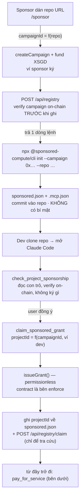
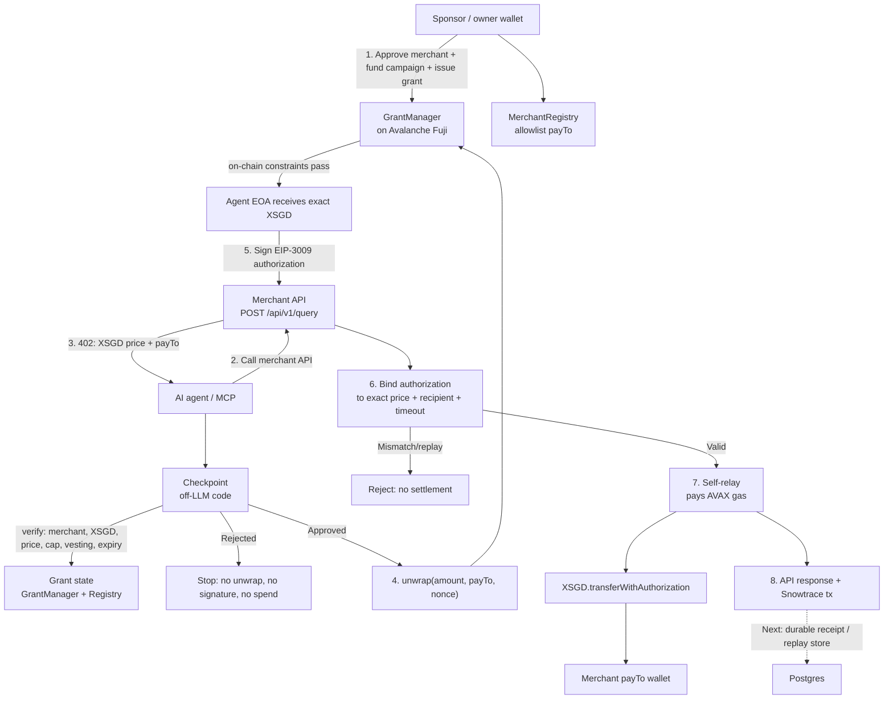

# Sponsored Compute — Onboarding & Payment Workflow

## Onboarding: repo → funded campaign → developer Grant

Sponsor chỉ dán URL repo. Mọi id on-chain suy ra từ đó ([src/campaign.ts](../src/campaign.ts)),
nên không có chỗ nào để gõ sai tên campaign.

- **Claim ≠ pay.** Claim cắt `grantAmount` từ pool thành Grant của một ví (XSGD chưa rời contract).
  Pay là mỗi lần gọi API, tiêu đúng số của lần đó trong hạn mức Grant.
- Repo fork lại mang `projectId` đã dùng → `ProjectAlreadyGranted`. Fork không nhân bản được tiền.
- Registry (`/api/registry`) **không cấp quyền**: nó chỉ chép lại thứ đã có trên chain, và
  route ghi luôn đọc chain trước. Registry chết thì Grant vẫn hợp lệ.

## Payment

## Security boundaries

1. The agent cannot decide to spend by itself: checkpoint runs before unwrap or signing.
2. `GrantManager` enforces merchant allowlist, per-transaction/daily caps, vesting, expiry, and revocation on-chain.
3. The merchant binds the submitted EIP-3009 authorization to the exact invoice recipient, amount, and validity window before self-relay settlement.
4. A mismatch, expired authorization, or replay is rejected before data is served or a transaction is broadcast.
5. The merchant serves the paid response only after the XSGD transfer succeeds on-chain.

## Production follow-up

Use a durable Postgres-backed receipt and nonce-claim store before deployment so payment history and replay protection survive instance restarts and redeploys.
